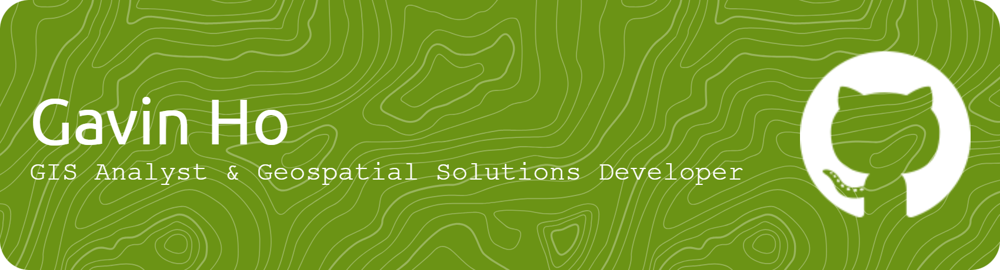

## About Me
I’m a GIS Analyst & Geospatial Solutions Developer with a strong background in GIS workflow development, automation, and remote sensing integration. I specialize in leveraging Python and GIS tools to build efficient geospatial applications that solve real-world problems.

[LinkedIn: Gavin Ho](https://www.linkedin.com/in/gavin-ho-925979239/)
